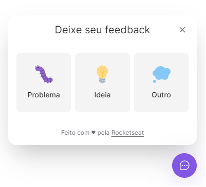
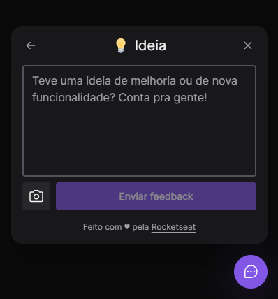

# NLW Return &ndash; Impulse

Projeto desenvolvido durante a **NLW Return**, evento de programação da Rocketseat, na trilha **Impulse**.

O projeto consiste em uma aplicação de feedbacks que conta com um widget no front-end para enviá-los, e um servidor back-end para recebê-los, salvá-los no banco de dados, e enviá-los por e-mail.

O widget permite selecionar um tipo de feedback, escrever um comentário e fazer uma captura da tela; já o back-end recebe esses dados e faz uma validação do feedback, retornando um erro, se necessário, ou retornando sucesso e criando o feedback no banco de dados e o enviando por e-mail para a equipe responsável pela aplicação.

Além do mais, o widget é totalmente acessível, responsivo e ainda conta com temas claro e escuro!

Link do website com o widget: https://nlw-return-heitorlisboa.vercel.app

🚧 **Back-end não está funcionando no host atual e será transferido para outro host** 🚧

 

  

 

  

 

## 👨‍💻 Tecnologias

- TypeScript
- React
- TailwindCSS
- HeadlessUI
- Node.js
- Jest
- Prisma

## 📈 Progresso

- [x] Dia 01 &ndash; Concluído!
  - Setup do projeto web
  - Construção da base do widget de feedback
- [x] Dia 02 &ndash; Concluído!
  - Finalização do widget
    - Escolha do tipo de feedback
    - Conteúdo do feedback
    - Funcionalidade de screenshot
    - Tela de sucesso ao enviar o feedback
- [x] Dia 03 &ndash; Concluído!
  - Construção do servidor da aplicação usando SOLID
  - Adição de testes unitários
- [ ] Dia 04 &ndash; Não concluído
  - Não consegui concluir essa aula por problemas para rodar a aplicação mobile
- [x] Dia 05 &ndash; Concluído!
  - Integração do front-end com o back-end
  - Deploy de ambas as partes da aplicação
